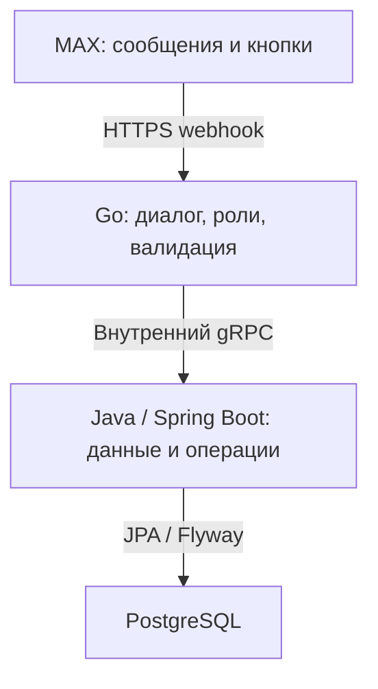

# Заявки в УК

Чат-бот для обращений жителей в управляющую компанию. Житель связывает профиль с квартирой, описывает проблему и получает номер заявки. Представитель УК видит обращения по своим домам и меняет статус обработки. Рабочее название проекта: «Заявки в УК».

**Статус:** код основного сценария реализован. Бот в MAX и публичный HTTPS-сервер пока не подключены, проверка в MAX ещё не проведена. По условиям трека это обязательный шаг до сдачи. Запуск Docker не заменяет доступный бот.

## Команда

| Участник | Роль |
| --- | --- |
| Артём Баранов | Backend |
| Олег Эмрих | Backend |
| Дмитрий Бердников | Backend, frontend |
| Михаил Мицкевич | Backend |

В репозитории интерфейс состоит из сообщений и кнопок бота. Отдельного веб-интерфейса или мини-приложения здесь нет.

## Пользователь и задача

Приоритетный пользователь: житель МКД, который сообщает о неэкстренной проблеме в подъезде или коммунальной системе и хочет проверить, приняла ли УК обращение. Второй пользователь: сотрудник УК, который ведёт очередь заявок по обслуживаемым домам.

Продуктовая гипотеза: заявка с адресом, категорией и статусом уменьшит число уточняющих сообщений по сравнению со свободной перепиской в домовом чате. Интервью и результатов пилота пока нет. [План проверки эффекта](docs/pilot.md).

## Основной сценарий

1. Представитель УК регистрируется в боте, вводит имя, фамилию и телефон.
2. Через «Мои дома» добавляет город, улицу и номер дома.
3. Житель со второго аккаунта регистрируется с ролью жителя.
4. Через «Мои квартиры» добавляет квартиру в ранее созданном доме.
5. Открывает «Заявки», «Новая заявка», выбирает категорию и вводит заголовок и описание.
6. Получает номер заявки со статусом «Новая».
7. УК выбирает фильтр «Новые» и нажимает «Взять в работу», затем завершает заявку.
8. Житель повторно открывает список и видит статус «Выполнена».

Автоматических уведомлений о смене статуса пока нет. Статус нужно запросить через меню. [Пошаговая проверка и ожидаемые ответы](docs/demo.md).

## Архитектура



| Компонент | Назначение | Технологии |
| --- | --- | --- |
| `golang-service` | События MAX, пошаговые диалоги, меню, временные сессии | Go 1.26.5, MAX SDK, gRPC, Zap |
| `api` | Пользователи, дома, квартиры, заявки и статусы | Java 21, Spring Boot 3.4.1, Gradle 8.14, JPA, Flyway, gRPC |
| `postgres` | Постоянное хранение данных | PostgreSQL 17 |

Go-зависимости зафиксированы в `go.mod` / `go.sum`, Java-зависимости в `build.gradle.kts` / `gradle.lockfile`. Docker использует сохранённый сгенерированный Go-код Protobuf без повторной генерации.

## Запуск в Docker

Нужны Docker Engine или Docker Desktop с Docker Compose v2 или новее и доступ к реестрам образов, Maven Central и Go modules. Локальные Java, Go и Gradle для Docker не требуются.

Скопируйте `.env.example` в `.env`, а `golang-service/.env.example` в `golang-service/.env`. В Linux/macOS/Git Bash:

```bash
cp .env.example .env
cp golang-service/.env.example golang-service/.env
```

Укажите непустой пароль БД в `.env`. В `golang-service/.env` заполните токен выданного бота, секрет webhook и действующий HTTPS-адрес. Секреты берите из закрытого канала команды.

| Переменная | Файл / источник | Назначение |
| --- | --- | --- |
| `POSTGRES_USER` | `.env` | Пользователь БД, по умолчанию `postgres` |
| `POSTGRES_PASSWORD` | `.env` | Обязательный непустой пароль БД |
| `POSTGRES_PORT` | `.env` | Порт на localhost, по умолчанию `5432` |
| `MAX_BOT_TOKEN` | `golang-service/.env` | Выданный рабочий токен бота |
| `MAX_BOT_SECRET` | `golang-service/.env` | Секрет webhook, 5–256 символов `A-Z a-z 0-9 _ -` |
| `MAX_BOT_WEBHOOK_URL` | `golang-service/.env` | Внешний URL `https://<домен>/webhook` |
| `MAX_BOT_AUTO_SUBSCRIBE` | `golang-service/.env` | `true` для регистрации webhook при старте |
| `LOGGER_LEVEL` | `golang-service/.env` | `INFO` в примере |
| `HTTP_SHUTDOWN_TIMEOUT` | `golang-service/.env` | `30s` |
| `HTTP_ADDR` | Compose | `:8080` |
| `GRPC_DB_ADDR` | Compose | `api:9090` |
| `LOGGER_FOLDER` | Compose | `/app/logs` |

Все локальные компоненты запускаются одной командой из корня:

```bash
docker compose up -d --build
```

PostgreSQL проходит healthcheck, затем Spring применяет миграцию `V1__init_schema.sql`. Compose не проверяет успешную регистрацию webhook или полный сценарий. Проверяйте логи:

```bash
docker compose ps
docker compose logs --tail=100 api golang-service
curl http://localhost:8080/healthz
```

Последняя команда возвращает `{"status":"ok"}`. Она проверяет только HTTP-процесс, а не БД, токен или доставку событий MAX.

### Порты и HTTPS

| Адрес | Назначение |
| --- | --- |
| `127.0.0.1:8080` | Go: `POST /webhook`, `GET /healthz` |
| `127.0.0.1:8081` | Spring HTTP, бизнес-методов REST нет |
| `127.0.0.1:5432` | PostgreSQL, порт можно изменить |
| `api:9090` | Внутренний gRPC, не публикуется на хосте |

Для MAX нужен HTTPS reverse proxy, передающий `/webhook` на `127.0.0.1:8080/webhook` и сохраняющий заголовок `X-Max-Bot-Api-Secret`. Домен, TLS-сертификат и размещение сервера настраиваются отдельно. Для proxy в контейнере используйте общую Docker-сеть и адрес `golang-service:8080`.

### Остановка и повторный запуск

```bash
docker compose stop
docker compose start
```

Удаление контейнеров с сохранением БД и повторное создание:

```bash
docker compose down
docker compose up -d
```

БД сохраняется в volume `pgdata`. Команда `docker compose down -v` удаляет все данные. Черновики диалогов хранятся в памяти Go-процесса и при перезапуске теряются. Созданные профили, квартиры и заявки остаются в БД.

## Данные и интеграции

MAX Bot API является внешней интеграцией, для которой нужны токен и webhook. Пока бот не подключён, её работа не подтверждена.

Адреса домов вводит УК. Квартиры, ФИО, телефоны и заявки вводят пользователи. Для демонстрации используйте синтетические значения из [fixtures/demo.json](fixtures/demo.json). Это входные данные ручного сценария, а не дамп БД. ID пользователя и чата приходят из MAX, ID записей генерирует БД.

Подключений к ГИС ЖКХ, ФИАС, Госуслугам, реестрам собственников или диспетчерским системам нет. Демонстрационный дом вымышленный. Продукт не проверяет полномочия УК или права на квартиру.

До реального пилота нужны подтверждение полномочий, порядок обработки и удаления пользовательских данных, ограничение доступа и сроки хранения. Логи находятся внутри контейнера, постоянный сбор логов отдельно не настроен.

## Контракты и проверки

[openapi.yaml](openapi.yaml) описывает HTTP-транспорт Go. Бизнес-операции используют внутренний gRPC из `api/src/main/proto/uk_service.proto`. OpenAPI не подменяет этот контракт.

[DATA-API.yaml](DATA-API.yaml) содержит заготовку HTTP-проверок. Перед сдачей замените `example.invalid`, сверяйте формат с платформой оценки и уточните у организаторов способ проверки внутреннего gRPC. HTTP-проверки не покрывают создание и обработку заявки.

Java-сценарий:

```bash
cd api
./gradlew test
```

Тест использует H2 и проверяет создание заявки, статусы, фильтр УК и отказ для чужой квартиры и УК. H2 не заменяет проверку миграции PostgreSQL.

Go-тесты конфигурации webhook и компиляция:

```bash
cd golang-service
go test ./...
go build ./cmd/hackathon
```

## Известные ограничения

- Бот и публичное HTTPS-размещение отсутствуют.
- Роль УК и квартира выбираются по заявлению пользователя. Для публичного пилота нужна проверка полномочий.
- gRPC доверяет боту и не должен быть доступен из интернета. Проверка владельца не заменяет аутентификацию gRPC-клиента.
- Нет фото, уведомлений о смене статуса, SLA, подтверждения выполнения жителем, журнала статусов и защиты от повторных событий webhook.
- Списки выдаются без пагинации.
- Повторная привязка той же квартиры может завершиться ошибкой уникальности.
- Выбран неэкстренный сценарий содержания дома. Эскалации в аварийные или межведомственные службы нет.
- Холодную Docker-сборку и лимит в 5 минут необходимо измерить в окружении команды.

## Сдача

PDF-презентация: `docs/presentation.pdf`. Редактируемая версия: `docs/presentation.pptx`. [Чек-лист обязательных материалов](docs/submission-checklist.md).

Зафиксируйте окончательную версию кода:

```bash
git rev-parse HEAD
```

Рабочие токены и пароли нельзя помещать в публичный репозиторий или публичный PDF. Передайте жюри закрытую копию служебного первого слайда через согласованный с организаторами канал. Публичная версия содержит только перечень параметров.

Источники: кейс «Умный город», страницы 6–13 и 18–20, текущая реализация репозитория. Эффективность и пользовательские исследования не заявляются как уже подтверждённые.
